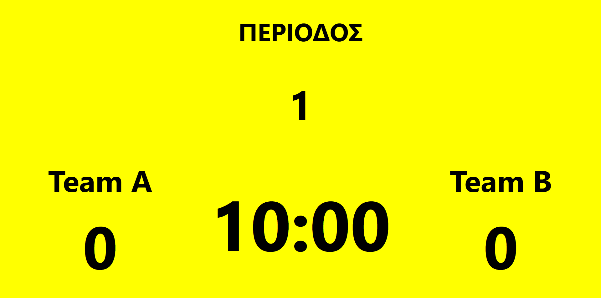
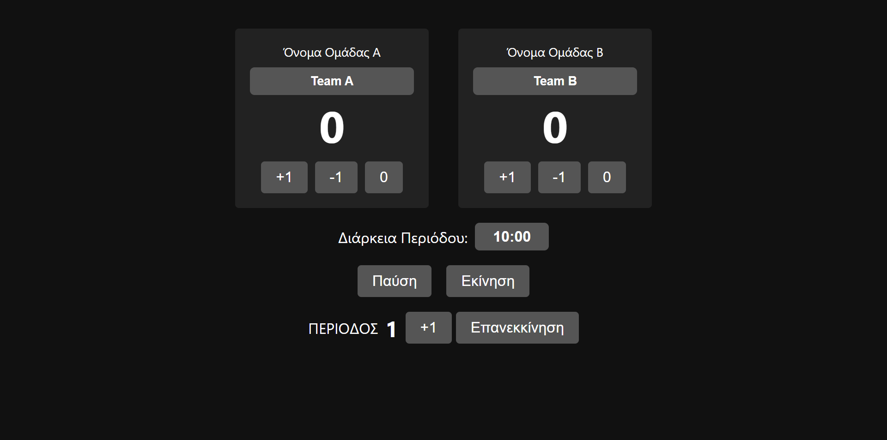

# 🏀 Real-Time Scoreboard

 

> **Τοπική real-time εφαρμογή** προβολής & διαχείρισης σκορ για **μπάσκετ** ή **ποδόσφαιρο**, με προσαρμοσμένα ονόματα ομάδων, χρονομετρητή και μετρητή περιόδων.

---

## 📖 Περιεχόμενα
1. [Screenshots](#screenshots)
2. [Features](#features)
3. [Αρχιτεκτονική](#αρχιτεκτονική)
4. [Εγκατάσταση](#εγκατάσταση)
5. [Χρήση](#χρήση)
6. [Παραμετροποίηση](#παραμετροποίηση)
7. [Συνεισφορά](#συνεισφορά)
8. [License](#license)

---

## 💻 Screenshots

<p align="center">
  
</p>

<p align="center">
  
</p>

---

## 🚀 Features
- 🎨 **Custom Team Names**: Αλλάζεις ονόματα ομάδων on-the-fly.
- ➕➖ **Score Controls**: +1 / –1 / Reset ανά ομάδα.
- ⏱️ **Countdown Timer**: Start / Pause, με auto-stop στο 00:00.
- 🔁 **Period Counter**: Μετρητής περιόδων + Reset.
- 🌐 **Live Sync**: Scoreboard & Control Panel real-time μέσω Socket.IO.

---

## 🏗️ Αρχιτεκτονική
- **Backend**: Node.js + Express + Socket.IO
- **Frontend**: Vanilla HTML / CSS / JS
- **Real-Time**: WebSockets (Socket.IO) για διπλά παράθυρα σε τοπικό LAN

---

## ⚙️ Εγκατάσταση

```bash
# 1. Κλωνοποίηση
git clone https://github.com/<USERNAME>/real-time-scoreboard.git
cd real-time-scoreboard

# 2. Εγκατάσταση dependencies
npm install

# 3. Εκκίνηση server
npm start
```

---

## 📝 Χρήση

1. **Scoreboard View**
   - Άνοιξε: `http://localhost:3000/`
2. **Control Panel**
   - Άνοιξε: `http://localhost:3000/?view=controller`

<details>
<summary>▶️ Οδηγίες</summary>

- Στο Control Panel, γράψε νέο χρόνο (`MM:SS`) → **Enter**.
- Πάτησε **Εκίνηση** για να ξεκινήσει το countdown.
- Πάτησε **Pause** για να σταματήσει προσωρινά.
- Κουμπιά **+1 / –1 / 0** για κάθε ομάδα.
- **+1** ή **Reset** για την περίοδο.

</details>

---

## 🎨 Παραμετροποίηση
- **Αρχικός χρόνος**: Στο `server.js`, αλλαγή `state.time = { minutes: X, seconds: Y, running: false }`.
- **Αρχικά ονόματα ομάδων**: `state.teams.A.name` & `state.teams.B.name`.

---

## 🤝 Συνεισφορά
1. Fork & Clone
2. Δημιουργία branch: `git checkout -b feature/YourFeature`
3. Commit changes: `git commit -m "feat: περιγραφή αλλαγής"`
4. Push: `git push origin feature/YourFeature`
5. Άνοιξε Pull Request

---

## 📄 License
MIT © <Your Name>
